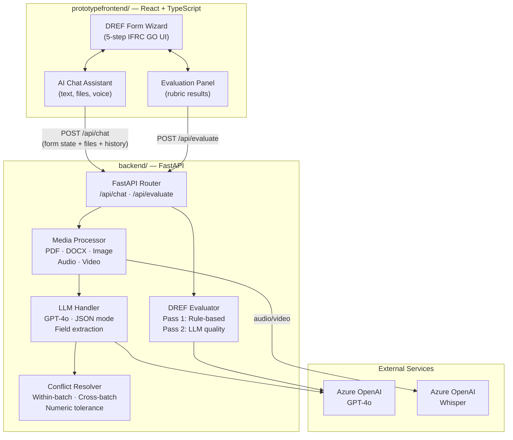

# DREF Assist

**AI-powered assistant for faster IFRC disaster response applications**


DREF Assist helps emergency surveyors complete [DREF (Disaster Response Emergency Fund)](https://www.ifrc.org/disaster-response-emergency-fund-dref) applications faster and to a higher standard. It accepts multimodal inputs — text, PDFs, images, voice recordings, and video — processes them through Azure OpenAI GPT-4o, and automatically populates the DREF application form via a conversational chat interface. When conflicting data is detected across sources, the system pauses for human resolution. A built-in evaluation engine scores the completed application against IFRC rubric criteria and suggests improvements.

---

## Table of Contents

- [Architecture](#architecture)
- [Key Features](#key-features)
- [Repository Structure](#repository-structure)
- [Tech Stack](#tech-stack)
- [Quickstart](#quickstart)
- [Links](#links)
- [Team](#team)
---

## Architecture



> The system is **stateless** — the frontend sends the full form state, conversation history, and files with every request. No database or session storage is required.

---

## Key Features

- **Multimodal input** — upload PDFs, DOCX, images, audio recordings, and video; each processed by a specialised handler
- **Auto field population** — GPT-4o extracts structured data from uploads and chat messages, mapping it to 56 DREF form fields
- **Conflict resolution** — detects contradictions between new data and existing form values, pauses for user decision
- **Automated evaluation** — two-pass scoring (rule-based + LLM) against the IFRC rubric with actionable improvement suggestions
- **IFRC GO integration** — UI styled to match the existing IFRC GO platform to avoid retraining field officers
- **Conversational interface** — natural-language chat with full conversation history for iterative form completion
- **Multilingual support** — GPT-4o handles input in any language; Whisper transcribes non-English audio

---

## Repository Structure

```
DREF-Assist/
├── README.md                  ← You are here
├── backend/                   ← FastAPI backend — AI pipeline, evaluation, API
│   ├── app.py                    Entry point & route definitions
│   ├── services/                 Orchestrator (media → LLM → conflicts)
│   ├── llm_handler/              GPT-4o prompt building, calling, parsing
│   ├── media-processor/          Handlers for PDF, DOCX, image, audio, video
│   ├── conflict_resolver/        Conflict detection & resolution logic
│   ├── dref_evaluation/          Rubric-based evaluation engine (43 criteria)
│   ├── tests/                    End-to-end tests
│   └── README.md                 Detailed backend docs
├── prototypefrontend/         ← React frontend — DREF form UI + chat + evaluation
│   └── drefprototype/
│       ├── src/
│       │   ├── pages/            Multi-step form wizard
│       │   ├── components/       Chat, evaluation panel, form steps, IFRC header/footer
│       │   └── lib/              API client, type definitions, utilities
│       └── README.md             Detailed frontend docs
└── docs/                      ← Design documents & plans
```

---

## Tech Stack

| Component | Technology |
|---|---|
| Backend framework | FastAPI (Python 3.10+), Uvicorn |
| LLM | Azure OpenAI GPT-4o (JSON mode, temperature 0.1) |
| Speech-to-text | Azure OpenAI Whisper |
| Media processing | PyMuPDF (PDF), python-docx (DOCX), OpenCV (video frames), Pillow, imagehash |
| Frontend framework | React 18 + TypeScript, Vite 7 |
| UI components | shadcn/ui (45+ Radix primitives), Tailwind CSS 3.4 |
| Forms | React Hook Form + Zod validation |
| Server state | TanStack React Query |
| State architecture | Stateless — enriched form state (value + source + timestamp) sent per request |

---

## Quickstart

### Prerequisites

- **Python 3.10+** and **pip**
- **Node.js 18+** and **npm**
- **FFmpeg** (for video frame extraction) — `brew install ffmpeg` / `apt install ffmpeg`
- **Azure OpenAI** resource with GPT-4o and Whisper deployments ([setup guide](https://learn.microsoft.com/en-us/azure/ai-services/openai/how-to/create-resource))

### 1. Clone

```bash
git clone https://github.com/fbs617/DREF-Assist.git
cd DREF-Assist
```

### 2. Start the backend

```bash
cd backend
python3 -m venv .venv && source .venv/bin/activate
pip install -r requirements.txt
# Create .env with your Azure OpenAI keys (see backend/README.md for all variables)
uvicorn app:app --reload --port 8000
```

> See [backend/README.md](backend/README.md) for the full environment variable table and detailed setup.

### 3. Start the frontend

```bash
cd prototypefrontend/drefprototype
npm install
npm run dev
```

Open **http://localhost:8080** — you should see the IFRC GO-styled DREF form with the AI chat assistant in the bottom-right corner.

> See [prototypefrontend/README.md](prototypefrontend/README.md) for detailed frontend configuration.

---

## Links

| Resource | URL |
|---|---|
| Backend documentation | [backend/README.md](backend/README.md) |
| Frontend documentation | [prototypefrontend/README.md](prototypefrontend/README.md) |
| UCL IXN Programme | [ucl.ac.uk/computer-science/collaborate/ucl-industry-exchange-network-ucl-ixn](https://www.ucl.ac.uk/computer-science/collaborate/ucl-industry-exchange-network-ucl-ixn/) |
| IFRC DREF Information | [ifrc.org/disaster-response-emergency-fund-dref](https://www.ifrc.org/disaster-response-emergency-fund-dref) |
| IFRC GO Platform | [go.ifrc.org](https://go.ifrc.org/) |

---

## Team

**DREF Assist** is a UCL COMP0016 IXN project (2025–26) built for the [International Federation of Red Cross and Red Crescent Societies (IFRC)](https://www.ifrc.org/).

| Name | GitHub |
|---|---|
| Fahad Al Saud | [@fbs617](https://github.com/fbs617) |
| Brendan Loo | [@brendanlhm](https://github.com/brendanlhm) |
| Sameer Chowdhury | [@1sameerchowdhury](https://github.com/1sameerchowdhury) |
| Mohammed Talab | [@MohiCodeHub](https://github.com/MohiCodeHub) |
| Emir Akdag | [@emirakdag0](https://github.com/emirakdag0) |

**Client:** IFRC — International Federation of Red Cross and Red Crescent Societies
**Academic context:** UCL Department of Computer Science — COMP0016 Systems Engineering (IXN), 2025–26

