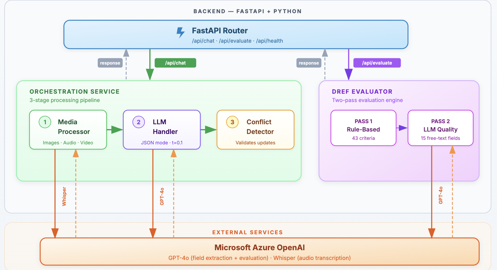

# DREF Assist — Backend


The DREF Assist backend is a **stateless FastAPI application** that powers the AI pipeline behind DREF application assistance. It accepts multimodal inputs (text, images, PDFs, DOCX, audio, video — one file per message), processes them through media-specific handlers, sends the extracted content to Azure OpenAI GPT-4o for field extraction, and detects conflicts when new data contradicts existing form values. Chat responses are streamed in real time via **SSE (Server-Sent Events)**. A two-pass evaluation engine scores completed applications against the IFRC rubric. The frontend sends the full form state with every request — the backend stores nothing.

---

## Table of Contents

- [Architecture Overview](#architecture-overview)
- [Prerequisites](#prerequisites)
- [Environment Variables](#environment-variables)
- [Installation](#installation)
- [Running the Application](#running-the-application)
- [Running Tests](#running-tests)
- [API Reference](#api-reference)
- [Project Structure](#project-structure)
- [Contributing](#contributing)
- [Team and Acknowledgements](#team-and-acknowledgements)

---

## Architecture Overview



**Key design decisions:**

| Decision | Rationale |
|---|---|
| Stateless | All state (form values, conversation history) is passed per request — no database or session storage required. |
| SSE streaming | `/api/chat` returns a Server-Sent Events stream (`status`, `reply_chunk`, `done`, `error` events) for real-time token-by-token delivery. |
| Singleton client | A shared `AzureOpenAI` client instance is reused across requests (one for chat, one for evaluation) to avoid recreating TCP connections. |
| One file per message | File uploads are limited to a single file per chat message to simplify processing and improve reliability. |
| Modular | Each concern (media, LLM, conflicts, evaluation) is an independent package with its own tests. |
| Hybrid evaluation | Non-text fields are evaluated with deterministic rules; text fields use LLM-based quality assessment. |
| Field taxonomy | Fields are categorised as FACTUAL (extract only explicit values), INFERRED (logical deduction), or SYNTHESIZED (compose from evidence). |

---

## Prerequisites

| Dependency | Version | Notes |
|---|---|---|
| **Python** | 3.10+ | Tested on 3.12 and 3.13; uses modern type hints and `dataclass` features. |
| **pip** | Latest | Or any Python package manager (e.g. `uv`, `poetry`). |
| **FFmpeg** | Latest | Required by OpenCV for video frame extraction. [Install guide →](https://ffmpeg.org/download.html) |
| **Azure OpenAI access** | — | You need an Azure OpenAI resource with **GPT-4o** and **Whisper** deployments. |

> On macOS: `brew install python ffmpeg`
> On Ubuntu: `sudo apt install python3 python3-pip ffmpeg`

---

## Environment Variables

Create a `.env` file in the `backend/` directory. Every variable listed below is loaded via `python-dotenv` at startup.

> **⚠️ Security note:** Never commit real API keys to the repository. The `.gitignore` already excludes `.env` files.

| Variable | Required | Description | Example |
|---|---|---|---|
| `AZURE_OPENAI_API_KEY` | **Yes** | API key for your Azure OpenAI GPT-4o deployment. | `sk-abc123...` |
| `AZURE_OPENAI_ENDPOINT` | **Yes** | Full endpoint URL for the Azure OpenAI resource. | `https://my-resource.openai.azure.com/openai/deployments/gpt-4o/chat/completions?api-version=2025-01-01-preview` |
| `AZURE_OPENAI_API_VERSION` | **Yes** | API version string. | `2024-02-15-preview` |
| `AZURE_OPENAI_DEPLOYMENT` | **Yes** | Deployment name for GPT-4o. | `gpt-4o` |
| `AZURE_OPENAI_AUDIO_API_KEY` | **Yes** | API key for the Azure Whisper deployment (audio transcription). | `sk-xyz789...` |
| `AZURE_OPENAI_AUDIO_ENDPOINT` | **Yes** | Full endpoint URL for the Whisper deployment. | `https://my-audio.cognitiveservices.azure.com/openai/deployments/whisper/audio/translations?api-version=2024-06-01` |
| `AZURE_OPENAI_AUDIO_API_VERSION` | **Yes** | API version for the Whisper deployment. | `2024-02-15-preview` |
| `AZURE_OPENAI_AUDIO_DEPLOYMENT` | **Yes** | Deployment name for Whisper. | `whisper` |

> **Where to get these:** Create an [Azure OpenAI resource](https://learn.microsoft.com/en-us/azure/ai-services/openai/how-to/create-resource) in the Azure portal, deploy GPT-4o and Whisper models, then copy the keys and endpoints from the resource's "Keys and Endpoint" page.

---

## Installation

```bash
# 1. Clone the repository (if you haven't already)
git clone https://github.com/IFRCGo/DREF-Assist.git
cd DREF-Assist/backend

# 2. Create and activate a virtual environment
python3 -m venv .venv
source .venv/bin/activate        # macOS / Linux
# .venv\Scripts\activate         # Windows

# 3. Install Python dependencies
pip install -r requirements.txt

# 4. Create your environment file
# Create a .env file using the Environment Variables table above
```

> ⚠️ **Note:** There is no `.env.example` file — create a `.env` file manually using the [Environment Variables](#environment-variables) table above.

---

## Running the Application

```bash
# From the backend/ directory, with the virtual environment activated:
uvicorn app:app --reload --host 127.0.0.1 --port 8000
```

**Expected output:**

```
INFO:     Uvicorn running on http://127.0.0.1:8000 (Press CTRL+C to quit)
INFO:     Started reloader process [xxxxx] using StatReload
INFO:     Started server process [xxxxx]
INFO:     Waiting for application startup.
INFO:     Application startup complete.
```

Verify it's working:

```bash
curl http://127.0.0.1:8000/api/health
# → {"status":"ok"}
```

---

## Running Tests

The test suite uses **pytest**. Tests are distributed across each module:

```bash
# Run all unit tests (from backend/ directory)
pytest

# Run with verbose output
pytest -v

# Run a specific module's tests
pytest conflict_resolver/tests/
pytest llm_handler/tests/
pytest media-processor/tests/
pytest services/tests/

# Run end-to-end tests (requires live Azure OpenAI credentials)
pytest tests/e2e/ -m e2e
```

### Test coverage by module

| Module | Test files | What they cover |
|---|---|---|
| `conflict_resolver/` | `test_detector.py` | Within-batch and cross-batch conflict detection, numeric tolerance, list comparison |
| `llm_handler/` | `test_handler.py`, `test_parser.py`, `test_prompt.py` | LLM response parsing, field validation, classification checks, prompt generation |
| `media-processor/` | 14 test files | All 5 handlers (image, audio, video, PDF, DOCX), frame sampling, perceptual hashing, transcription, routing, formatting, integration |
| `services/` | `test_assistant.py` | End-to-end assistant pipeline orchestration |
| `tests/e2e/` | `test_multimodal_e2e.py` | Full pipeline with real LLM calls — PDF, DOCX, image processing |

---

## API Reference

### `GET /api/health`

Health check endpoint.

**Response:**

```json
{ "status": "ok" }
```

**Example:**

```bash
curl http://127.0.0.1:8000/api/health
```

---

### `POST /api/chat`

Main conversational endpoint. Processes a user message (with an optional file upload) against the current form state and streams back field updates, conflicts, and a natural-language reply via **SSE (Server-Sent Events)**.

**Request:** `multipart/form-data`

| Field | Type | Description |
|---|---|---|
| `data` | JSON string (required) | `{"user_message": "...", "form_state": {...}, "conversation_history": [...]}` |
| `files` | File (optional) | A single uploaded file (image, PDF, DOCX, audio, or video). Only one file per message is allowed. |

**`data` payload schema:**

```json
{
  "user_message": "There was a flood in Nepal affecting 50,000 people",
  "form_state": {
    "operation_overview.country": {
      "value": "",
      "source": "user_input",
      "timestamp": "2025-01-01T00:00:00Z"
    }
  },
  "conversation_history": [
    { "role": "user", "content": "Hello" },
    { "role": "assistant", "content": "Hi! How can I help?" }
  ]
}
```

**Response:** `text/event-stream` (SSE)

The response is a stream of Server-Sent Events. Each event has a `type` and `data` field:

| Event type | Description | Data payload |
|---|---|---|
| `status` | Processing progress update | `{"message": "Processing uploaded file..."}` |
| `reply_chunk` | Incremental reply token | `{"delta": "I've", "snapshot": "I've"}` |
| `done` | Final complete response | Full JSON response (see below) |
| `error` | Processing error | `{"message": "..."}` |

**Final `done` payload:**

```json
{
  "classification": "NEW_INFORMATION",
  "reply": "I've extracted several fields from your message...",
  "field_updates": [
    {
      "field_id": "operation_overview.country",
      "value": "Nepal",
      "source": "chat_suggestion",
      "timestamp": "2025-06-15T10:30:00Z"
    }
  ],
  "conflicts": [
    {
      "field_name": "event_detail.total_affected_population",
      "field_label": "Total Affected Population",
      "existing_value": { "value": 30000, "source": "user_input", "timestamp": "..." },
      "new_value": { "value": 50000, "source": "chat_suggestion", "timestamp": "..." }
    }
  ],
  "processing_summary": {
    "total_files": 1,
    "successful": 1,
    "failed": 0
  }
}
```

**Classification values:** `NEW_INFORMATION`, `MODIFICATION_REQUEST`, `QUESTION`, `OFF_TOPIC`

**Example:**

```bash
curl -N -X POST http://127.0.0.1:8000/api/chat \
  -F 'data={"user_message":"Flood in Nepal, 50k affected","form_state":{},"conversation_history":[]}' \
  -F 'files=@report.pdf'
```

---

### `POST /api/evaluate`

Runs a full two-pass evaluation of the DREF application against the IFRC rubric.

**Request:** `application/json`

```json
{
  "form_state": {
    "operation_overview.country": { "value": "Nepal", "source": "user_input", "timestamp": "..." },
    "event_detail.what_happened": { "value": "A major flood...", "source": "chat_suggestion", "timestamp": "..." }
  }
}
```

**Response:**

```json
{
  "dref_id": 0,
  "overall_status": "needs_revision",
  "section_results": {
    "operation_overview": {
      "section_name": "operation_overview",
      "section_display_name": "Operation Overview",
      "status": "accept",
      "criteria_results": { ... },
      "issues": []
    }
  },
  "improvement_suggestions": [
    {
      "section": "event_detail",
      "field": "event_description",
      "criterion": "Description must include what, where, and when",
      "priority": 1,
      "guidance": "...",
      "ready_prompt": "Please improve the 'What Happened' field...",
      "auto_applicable": true
    }
  ],
  "pass_one_completed": true,
  "pass_two_completed": true,
  "reference_examples_used": []
}
```

**Example:**

```bash
curl -X POST http://127.0.0.1:8000/api/evaluate \
  -H "Content-Type: application/json" \
  -d '{"form_state":{"operation_overview.country":{"value":"Nepal","source":"user_input","timestamp":"2025-01-01T00:00:00Z"}}}'
```

---

### `POST /api/evaluate/section`

Evaluates a single section of the DREF application.

**Request:** `application/json`

```json
{
  "form_state": { ... },
  "section": "event_detail"
}
```

**Valid section values:** `operation_overview`, `event_detail`, `actions_needs`, `operation`, `operational_timeframe_contacts`

**Response:** Same structure as a single section from the full evaluation, plus an `improvement_suggestions` array.

**Example:**

```bash
curl -X POST http://127.0.0.1:8000/api/evaluate/section \
  -H "Content-Type: application/json" \
  -d '{"form_state":{},"section":"operation_overview"}'
```

---

### `GET /api/evaluate/rubric`

Returns the complete evaluation rubric (all sections, criteria, and field type mappings).

**Response:** The raw JSON content of `evaluation_rubric.json`.

**Example:**

```bash
curl http://127.0.0.1:8000/api/evaluate/rubric
```

---

## Project Structure

```
backend/
├── app.py                          # FastAPI entrypoint — routes, CORS, field mapping,
│                                   #   evaluation post-processing
├── requirements.txt                # Python dependencies
├── .env                            # Environment variables (git-ignored)
├── .gitignore
│
├── services/
│   ├── assistant.py                # Orchestrator — media → LLM → conflicts pipeline
│   └── tests/
│       └── test_assistant.py
│
├── llm_handler/
│   ├── handler.py                  # GPT-4o call with JSON mode (temperature 0.1)
│   ├── prompt.py                   # System prompt builder with field schema
│   ├── parser.py                   # Response parsing + field validation
│   ├── field_schema.py             # 56 field definitions, types, dropdown options,
│   │                               #   metadata (FACTUAL/INFERRED/SYNTHESIZED)
│   └── tests/
│       ├── test_handler.py
│       ├── test_parser.py
│       └── test_prompt.py
│
├── media-processor/
│   ├── media_processor/
│   │   ├── processor.py            # Orchestrates per-file processing
│   │   ├── router.py               # Routes files to appropriate handler
│   │   ├── models.py               # Data contracts (FileInput, ProcessingResult, etc.)
│   │   ├── formatter.py            # Assembles GPT-4o-compatible multimodal message
│   │   ├── handlers/
│   │   │   ├── image.py            # Image validation + base64 passthrough (max 20MB)
│   │   │   ├── audio.py            # Azure Whisper transcription (max 50MB)
│   │   │   ├── video.py            # Frame extraction + dedup + audio (max 100MB)
│   │   │   ├── pdf.py              # PyMuPDF text + image extraction (max 50 pages)
│   │   │   └── docx.py             # python-docx text + image extraction (max 25MB)
│   │   └── utils/
│   │       ├── transcription.py    # Azure Whisper API wrapper
│   │       ├── frame_sampler.py    # Uniform frame sampling (5–20 frames)
│   │       └── perceptual_hash.py  # imagehash deduplication (>90% similarity)
│   └── tests/                      # 14 test files covering all handlers & utilities
│
├── conflict_resolver/
│   ├── detector.py                 # Two-phase conflict detection with numeric tolerance
│   ├── manager.py                  # Pending conflict queue + resolution history
│   ├── service.py                  # Integration service (process → detect → resolve)
│   └── tests/
│       └── test_detector.py
│
├── dref_evaluation/
│   ├── evaluator.py                # Two-pass evaluator (rule-based + LLM)
│   ├── evaluation_rubric.json      # 43 criteria across 5 sections
│   ├── integration.py              # Django integration (not used by prototype)
│   ├── models.py                   # Django models (not used by prototype)
│   └── ...                         # Django boilerplate (admin, views, migrations, etc.)
│
└── tests/
    └── e2e/
        ├── test_multimodal_e2e.py  # Full pipeline tests with live LLM
        ├── fixtures.py             # Test document generators
        └── conftest.py             # Pytest configuration + markers
```

---

## Contributing

### Branch naming

```
feature/<short-description>    # New features
fix/<short-description>        # Bug fixes
refactor/<short-description>   # Code restructuring
```

### Opening a pull request

1. Create a feature branch from `main`.
2. Make your changes with clear, atomic commits.
3. Ensure all tests pass (`pytest`).
4. Open a PR against `main` with a description of what changed and why.
5. Request a review from at least one team member.

### Code style

- Follow [PEP 8](https://peps.python.org/pep-0008/) for Python code.
- Use type hints on all public function signatures.
- Keep modules self-contained with their own tests.

---

## Team and Acknowledgements

**DREF Assist** is a UCL COMP0016 IXN project (2025–26) built for the [International Federation of Red Cross and Red Crescent Societies (IFRC)](https://www.ifrc.org/).

### Team

| Name | GitHub |
|---|---|
| Fahad Al Saud | [@fbs617](https://github.com/fbs617) |
| Brendan Loo | [@brendanlhm](https://github.com/brendanlhm) |
| Sameer Chowdhury | [@1sameerchowdhury](https://github.com/1sameerchowdhury) |
| Mohammed Talab | [@MohiCodeHub](https://github.com/MohiCodeHub) |
| Emir Akdag | [@emirakdag0](https://github.com/emirakdag0) |

### Client

**IFRC** — International Federation of Red Cross and Red Crescent Societies

### Academic context

**UCL** Department of Computer Science — COMP0016 Systems Engineering (IXN), 2025–26
